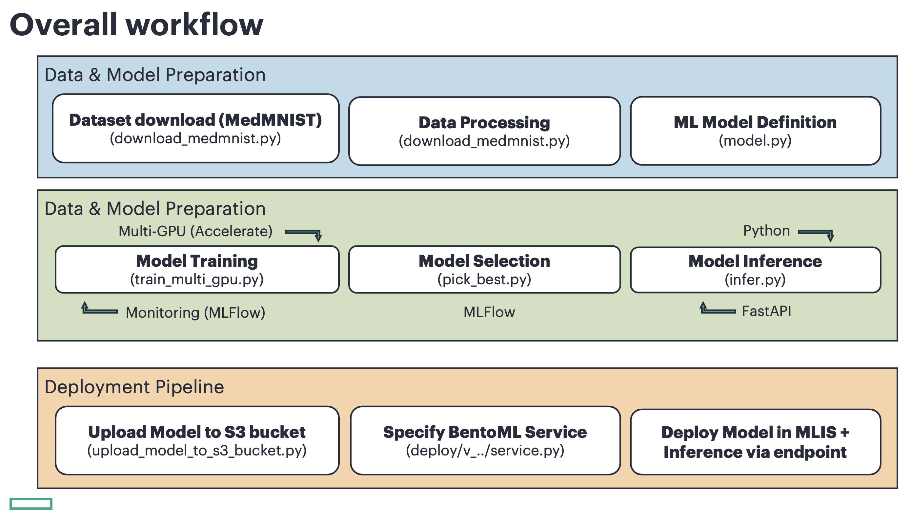

# MLFlow + BentoML End-to-End Model Lifecycle: Training, Monitoring, and Deployment

| Owner                 | Name              | Email                              |
| ----------------------|-------------------|------------------------------------|
| Use Case Owner        | Francesco Caliva | francesco.caliva@hpe.com |

## Abstract

This demo demonstrates a **complete AI/ML pipeline** — from dataset preparation and model training to deployment with **BentoML** and **MLFlow** integration.  
It uses the **MedMNIST** dataset and a **CNN model**, showcasing both local and cloud-based workflows.

### Overview


### Workflow / Key Features
- Dataset download and preprocessing  
- CNN architecture and training with MLFlow monitoring  
- Multi-GPU acceleration via the Accelerate library  
- Best model selection with MLFlow metrics tracking  
- Inference options (Python & FastAPI)  
- Model upload to S3 and deployment via MLIS  
- Full BentoML packaging for portable inference

---

## Environment Setup

### Option 1 — BentoML (Latest Version)
```bash
python -m venv .venv_bento_v_latest
source .venv_bento_v_latest/bin/activate
pip install -r requirements.txt
```

### Option 2 — BentoML v1.1.11 (Legacy)
```bash
python -m venv .venv_bento_v_1.1.11
source .venv_bento_v_1.1.11/bin/activate
pip install -r deploy/v_1.1.11/requirements.txt
```

---

## Model Training

You can train locally with MLFlow or use the Private Cloud AI (PC-AI)-hosted version of MLFlow with S3 artifact storage.

Start by preparing the `.env.local` or `env.PC-AI` files.

### Example `.env.local`
```bash
MLFLOW_TRACKING_URI="http://127.0.0.1:5000"
MLFLOW_S3_ENDPOINT_URL=""
```

### Example `.env.PC-AI`
```bash
MLFLOW_TRACKING_URI="http://mlflow.mlflow.svc.cluster.local:5000"
MLFLOW_S3_ENDPOINT_URL="http://local-s3-service.ezdata-system.svc.cluster.local:30000"
```

**Note:** MLFLOW_S3_ENDPOINT_URL is needed to save artifacts into S3. It's not required if one wants to log models locally.

In PC-AI, `MLFLOW_S3_ENDPOINT_URL` can be found in the `configurations` of MLFlow in Tools & Frameworks within AEI.

Look for: 

```yaml
extraEnvVars:
    MLFLOW_S3_ENDPOINT_URL
```

### Start MLFlow Server (Local)
```bash
mlflow server --backend-store-uri sqlite:///mlflow.db --default-artifact-root ./mlruns --port 5000
```

### Train Model (Local)
```bash
python train_multi_gpu.py --local-mlflow
```

Based on the MLFLOW_TRACKING_URI, one can monitor training on port 5000 of the local host at [http://127.0.0.1:5000](http://127.0.0.1:5000).

### Train Model (PC-AI)
```bash
python train_multi_gpu.py
```

One can monitor training on the MLFlow application within PC-AI. Visit Tools & Frameworks in AIE. 

Please look at the [train_multi_gpu.py](./code/train_multi_gpu.py) file for info about the arguments that can be specified *e.g.* lr, epochs, etc..

---

## Best Model Selection

### Local

Retrieve the best run using:

```bash
python pick_best.py --local-mlflow
```

### PC-AI

Retrieve the best run using:

```bash
python pick_best.py
```

Example output:
```bash
INFO:root:Best run: run_id: 90e141f06f3f472d854dd9b8f7393eaf - metric: 0.8857
INFO:root:Model URI to load: >> models:/medmnist_cnn/3
INFO:root:Model exported with BentoML: medmnist_cnn:e4jgrjv6not6rvtm
```

---

## Inference

### Setup Model URI
```bash
export MODEL_URI=models:/medmnist_cnn/3
```

### Option 1 — Local File Inference

Use path to file.

```bash
export LOCAL_MLFLOW=False/True
python download_medmnist.py --data-split test
python infer.py --model-uri $MODEL_URI --file-path ./datasets/medmnist/pathmnist/test/000000.png
```

### Option 2 — Dataset File ID Inference

Use file id within the medmnist dataset.
```bash
export LOCAL_MLFLOW=False/True
python infer.py --model-uri $MODEL_URI --file-id 0
```

### Option 3 — FastAPI Server

```bash
uvicorn infer:app --host 127.0.0.1 --port 8011 --reload
```

**Option A - Local File Inference**
```bash
export LOCAL_MLFLOW=True/False
export MODEL_URI="models:/medmnist_cnn/3"
export DATA_FLAG=pathmnist
curl -X POST "http://127.0.0.1:8011/predict_from_filepath" -F file=@./datasets/medmnist/pathmnist/test/000000.png
```

**Option B - Dataset File ID Inference**
```bash
export LOCAL_MLFLOW=True/False
export MODEL_URI="models:/medmnist_cnn/3"
export DATA_FLAG=pathmnist
curl -X POST "http://127.0.0.1:8011/predict_from_file_id" -F file_id=0
```
---

## BentoML Packaging and Deployment (MLIS)

### BentoML Latest Version Example

Find the `BENTO_MODEL_ARTIFACT` by: 

```bash
bentoml models list
```

Export it with *e.g.*:
```bash
export BENTO_MODEL_ARTIFACT=medmnist_cnn:e4jgrjv6not6rvtm
```

Write down this `tag` (*e.g.* `medmnist_cnn:e4jgrjv6not6rvtm`) because  will be needed later while packaging the model in MLIS. 

The reason for this, is that in the [deploy/v_latest/service.py](deploy/v_latest/service.py) file, there is `BENTO_MODEL_ARTIFACT = os.environ.get("BENTO_MODEL_ARTIFACT", None)` which is needed at deployment time.


Next, serve the Bento:
```bash
bentoml serve service:MedmnistCNNModel --working-dir deploy/v_latest/
```

Test if serving works in Python:

```python
import requests
url = "http://localhost:3000/predict"
image_link = "https://drive.google.com/uc?export=download&id=1-jQJ6kvDNEtK_CZaRFicvMDWYz7_qfaf"
response = requests.post(url, json={"input_data": image_link})
print(response.json())
```

### Build Bento Package
```bash
cd deploy/v_latest
bentoml build
```

Example output:
```
Successfully built Bento(tag="medmnist_cnn_model:ubj6spf5dw2gdvtm")
```

### Fix Bento Archive (for MLIS)
```bash
sh fix_bento_archive.sh medmnist_cnn:ubj6spf5dw2gdvtm
```

This will create export and create .bento file `medmnist_cnn_demo-bento-v-latest.bento` in your `code/deploy/v_latest/` folder

Example output:
```
Bento file exported correctly with name medmnist_cnn_demo-bento-v-latest.bento
```

---

**Why do we fix bento Archive in MLIS?** 

MLIS deployment of Bento archives expects some files that are generated in BentoML 1.1.11 during the `bento build` step. 

Specifically, MLIS deployment's BentoML model initializer expects to find an install.sh file in `env/python` which BentoML v 1.1.11 creates during `BentoML build`. 

What we can do is to manually add that `install.sh` here in [deploy/v_latest/install.sh](./code/deploy/v_latest/install.sh): 

```bash
#!/usr/bin/env bash
set -e
pip install --no-cache-dir -r ${BENTO_PATH}/env/python/requirements.txt
```

You also need to specify the `requirements.txt` file

Here [deploy/v_latest/requirements.txt](code/deploy/v_latest/requirements.txt) looks like:

```bash
requirements.txt
bentoml
mlflow<=2.22.0
torch>=2.0
torchvision
pillow
numpy
requests
medmnist==2.2.0
```

For the reasons why BentoML does not add this install.sh file any longer, please refere to their official documentation.

Script `fix_bento_archive.sh` takes care of positioning these files within the `.bento` file.

---

## Upload Model to PC-AI S3

You need to collect the following info from your S3 storage solution (*e.g.* [MinIO](https://github.com/ai-solution-eng/frameworks/tree/main/minio)).

```
- AWS_ACCESS_KEY_ID
- ENDPOINT_URL
- AWS_SECRET_ACCESS_KEY 
```

---

Here we provide instructions on how to set up a S3 solution in PC-AI, using `MinIO` as an example. 

- Checkout the helm chart related to MinIO in our team's repository [MinIO](https://github.com/ai-solution-eng/frameworks/tree/main/minio)

- Install it in PC-AI, via Helm Chart by using the AIE Tools & Framework import wizard

- Navigate to Tools & Frameworks and `open` MinIO application.

- Within MinIO, On the left side, click `Access Keys` and create a Access Key. Save `Access Key` and `Secret Key`. These are the values that you will use when prompted later. In this doc and in the code they have been called also `AWS_ACCESS_KEY_ID` and `AWS_SECRET_ACCESS_KEY` respectively.
As `ENDPOINT_URL`, if you are using MinIO from the same environment where you installed, you can use `http://minio.minio.svc.cluster.local:9000`

**Note** that different users have different permission levels, so if you don't have rights to create a `bucket`, you need to have that created by a system administrator. In MinIO they can follow these steps:

- Click on `Bucket` on the left side 
- `Create Bucket`.
- Create an `access key`
- Save and share them with you `Access Key`, `Secret Key`, with also the `Bucket Name` (AKA S3_BUCKET_NAME)

---

Then export the values which you collected above.

```
export S3_BUCKET_NAME="..."
export AWS_ACCESS_KEY_ID="..."
export ENDPOINT_URL="..."
export AWS_ACCESS_KEY_ID="..."
```

**Upload to S3 bucket**

Now, from within folder `code` run:

```bash
python upload_model_to_s3_bucket.py \
--s3-bucket-name ${S3_BUCKET_NAME} \
--aws-access-key-id ${AWS_ACCESS_KEY_ID} \
--aws-secret-access-key ${AWS_SECRET_ACCESS_KEY} \
--endpoint-url ${ENDPOINT_URL} \
--bento-file deploy/v_latest/medmnist_cnn_demo-bento-v-latest.bento
```

Recommend unsetting the variables now, as they may conflict with other applications:
```bash
unset AWS_ACCESS_KEY_ID
unset AWS_SECRET_ACCESS_KEY
```
---

## Legacy BentoML v1.1.11 Workflow

If you haven't already, create a virtual environment with BentoML v 1.1.11 

```bash
python3.10 -m venv .venv_bento_v_1_1_11
source .venv_bento_v_1_1_11/bin/activate
pip install -r ./deploy/v_1.1.11/requirements.txt
```

If you already trained the model above with BentoML latest Version, you just need to re-save the best model using BentoML v1.1.11 which can be easily done with

```bash
python pick_best.py
```

Example output:
```
INFO:root:Best run: run_id: 90e141f06f3f472d854dd9b8f7393eaf - metric: 0.8857
INFO:root:Model URI to load: >> models:/medmnist_cnn/3 <<
INFO:root:Model exported with BentoML: medmnist_cnn:e4jgrjv6not6rvtm
```

Write down this `tag` (*e.g.* `medmnist_cnn:e4jgrjv6not6rvtm`) because  will be needed later while packaging the model in MLIS.

The reason for this, is that in the [deploy/v_1.1.11/service.py](deploy/v_1.1.11/service.py) file, there is `BENTO_MODEL_ARTIFACT = os.environ.get("BENTO_MODEL_ARTIFACT", None)` which is needed at deployment time. Same applies to [deploy/v_1.1.11/bentofile.yaml](deploy/v_1.1.11/bentofile.yaml) where we see

```
models:
  - "medmnist_cnn:NONE" # UPDATE WITH YOUR MODEL NAME
```

Make sure you adapt 
- [code/deploy/v_1.1.11/bentofile.yaml](./code/deploy/v_1.1.11/bentofile.yaml) 

accordingly and export the value with:

```bash
export BENTO_MODEL_ARTIFACT=medmnist_cnn:e4jgrjv6not6rvtm
```

Next, serve locally:

```bash
cd deploy/v_1.1.11 
bentoml serve service.py:svc
```

Test locally with BASH:
```bash
curl -X POST \
  -H "Content-Type: text/plain" \
  --data "https://drive.google.com/uc?export=download&id=1-jQJ6kvDNEtK_CZaRFicvMDWYz7_qfaf" \
  http://localhost:3000/predict
```

or with Python:
**Option 2:** With Python
```python
import requests
url = "http://localhost:3000/predict"
image_link = "https://drive.google.com/uc?export=download&id=1-jQJ6kvDNEtK_CZaRFicvMDWYz7_qfaf"

response = requests.post(url, data=image_link, headers={"Content-Type": "text/plain"})
print(response.text)
```

Build 

```bash
bentoml build 
```

## Upload Model to PC-AI S3

You need to collect the following info from your S3 storage solution (*e.g.* [MinIO](https://github.com/ai-solution-eng/frameworks/tree/main/minio)).

```
- `AWS_ACCESS_KEY_ID`
- `ENDPOINT_URL`
- `AWS_SECRET_ACCESS_KEY` 
```

---

Here we provide instructions on how to set up a S3 solution in PC-AI, using `MinIO` as an example. 

- Checkout the helm chart related to MinIO in our team's repository [MinIO](https://github.com/ai-solution-eng/frameworks/tree/main/minio)

- Install it in PC-AI, via Helm Chart by using the AIE Tools & Framework import wizard

- Navigate to Tools & Frameworks and `open` MinIO application.

- Within MinIO, On the left side, click `Access Keys` and create a Access Key. Save `Access Key` and `Secret Key`. These are the values that you will use when prompted later. In this doc and in the code they have been called also `AWS_ACCESS_KEY_ID` and `AWS_SECRET_ACCESS_KEY` respectively.
As `ENDPOINT_URL`, if you are using MinIO from the same environment where you installed, you can use `http://minio.minio.svc.cluster.local:9000`

**Note** that different users have different permission levels, so if you don't have rights to create a `bucket`, you need to have that created by a system administrator. In MinIO they can follow these steps:

- Click on `Bucket` on the left side 
- `Create Bucket`.
- Create an `access key`
- Save and share them with you `Access Key`, `Secret Key`, with also the `Bucket Name` (AKA S3_BUCKET_NAME)

Then export the values which you collected above.

```
export S3_BUCKET_NAME="..."
export AWS_ACCESS_KEY_ID="..."
export ENDPOINT_URL="..."
export AWS_SECRET_ACCESS_KEY="..."
```

---

**Upload to S3 bucket**

Now, from within folder `code` run:

```bash
python upload_model_to_s3_bucket.py \
    --s3-bucket-name ${S3_BUCKET_NAME}
    --aws-access-key-id ${AWS_ACCESS_KEY_ID}    
    --aws-secret-access-key ${AWS_SECRET_ACCESS_KEY}
    --endpoint-url ${ENDPOINT_URL}
    --bento-file deploy/v_latest/medmnist_cnn_demo-bento-v-latest.bento 
```

Recommend unsetting the variables now, as they may conflict with other applications:
```bash
unset AWS_ACCESS_KEY_ID
unset AWS_SECRET_ACCESS_KEY
```
---


## Deploy in MLIS (this is the same for all versions)

1. **Launch MLIS** → under *Tools & Frameworks*
2. **Create Registry** (type S3) using decoded credentials
3. **Package Model**
4. **Deploy** with *fixed-1* scaling
5. **Generate Access Token**

### Deployment Example:

**Registry:**

    ```
    Name: e.g. minio-registry
    Type: S3
    Bucket name: $SAME S3_BUCKET_NAME
    Endpoint: #SAME ENDPOINT_URL
    Secret key: #SAME AWS_SECRET_ACCESS_KEY
    ```

**Packaging**

    ```
    Your model:
        Name: e.g. medmnist-cnn-bento-model
    Storage:
        Registry: $registry name specified above e.g. minio-registry
    Model format: Bento archive
        image: leave blank
    Model category: 
        URL: e.g. s3://medmnist-cnn-newbucket/model/medmnist_cnn_demo-bento-v-latest.bento # NOTE model/medmnist_cnn_demo-bento-v-latest.bento was printed on screen by the model upload script!
    Resouces:
        Use template for tiny cpu for this example
    Advanced:
        Specify the required env variables here, for instance in v_latest the bento model artifact was: 
        - BENTO_MODEL_ARTIFACT
            medmnist_cnn:e4jgrjv6not6rvtm     
    ```

**Deployment**

    ```
    Deployment:
        Name: medmnist-cnn-bento-model
    Packaged model: 
        medmnist-cnn-bento-model
    Scaling: 
        fixed-1
    Advanced: 
        Nothing needed here for this example
    ```

Don't forget to generate an use token.

---

## Remote Inference (Deployed Endpoint)

### BentoML Latest Version
**Option 1 — Bash**
```bash
export API_TOKEN=""
export MODEL_URI=""
export INPUT_DATA="https://drive.google.com/uc?export=download&id=1-jQJ6kvDNEtK_CZaRFicvMDWYz7_qfaf" # example
curl -vk -H "Authorization: Bearer $API_TOKEN" \
-X POST "${MODEL_URI}/predict" \
-H "Content-Type: application/json" \
-d "{\"input_data\": \"${INPUT_DATA}\"}"
```

**Option 2 — Python**
```python
import requests, json

API_TOKEN=""
MODEL_URI=""
INPUT_DATA="https://drive.google.com/uc?export=download&id=1-jQJ6kvDNEtK_CZaRFicvMDWYz7_qfaf" # example

url = f"{MODEL_URI}/predict"
headers = {"Authorization": f"Bearer {API_TOKEN}", "Content-Type": "application/json"}
data = {"input_data": INPUT_DATA}
response = requests.post(
    url, headers=headers, data=json.dumps(data), verify=False
)
print(response.json())
```

### BentoML Version 1.1.4 (Legacy)

```bash
export MODEL_URI=""
export API_TOKEN=""

curl -vk \
-H "Authorization: Bearer $API_TOKEN" \
-H "Content-Type: text/plain" \
--data "https://drive.google.com/uc?export=download&id=1-jQJ6kvDNEtK_CZaRFicvMDWYz7_qfaf" \ 
"${MODEL_URI}/predict"
```

**Option 2: With Python code**

```python
import requests, json

MODEL_URI=""
INPUT_DATA="https://drive.google.com/uc?export=download&id=1-jQJ6kvDNEtK_CZaRFicvMDWYz7_qfaf" # example
API_TOKEN=""

url = f"{MODEL_URI}/predict"
headers = {
    "Authorization": f"Bearer {API_TOKEN}",
    "Content-Type": "text/plain",
}
response = requests.post(url, headers=headers, data=INPUT_DATA, verify=False)
print(response.json())
```
---
## Summary

| Step | Component | Tool |
|------|------------|------|
| 1 | Data Prep | MedMNIST |
| 2 | Model Training | PyTorch + Accelerate |
| 3 | Experiment Tracking | MLFlow |
| 4 | Model Packaging | BentoML |
| 5 | Deployment | MLIS / S3 |
| 6 | Inference | REST / FastAPI / Python |

---

**This pipeline ensures full reproducibility and portability** — whether you’re deploying locally or into a managed ML environment like PC-AI MLIS.
