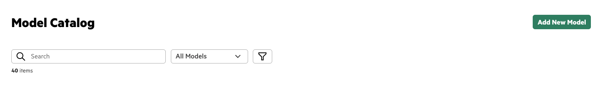
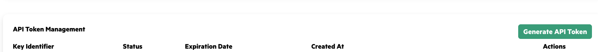
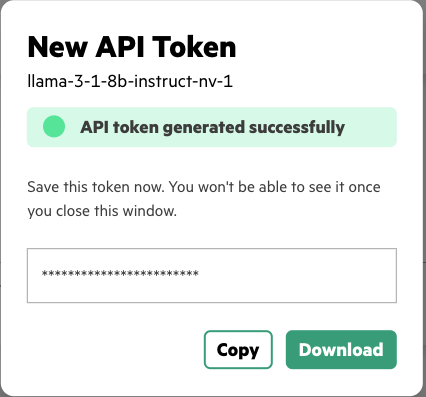

# Guardrail Configuration
## Walkthrough
### Setup
- Deploy the following models on MLIS:
    - Main model:
        - `nvidia/nemotron-3-nano`
            - Alternatively, you can deploy `Qwen/Qwen3-8B` for a smaller option
    - Guardrail model:
        - `meta/llama-3.1-8b-instruct`
    - Go to the `Model Catalog` page in the `Gen AI` tab within AIE
        - 
    - Select `Add New Model`
        - 
- Create the API Token and get the endpoint URL for the deployed models
    - Go to the `Model Endpoints` page in the `Gen AI` tab within AIE
        - 
    - Select `Generate API Token`
        - 
    - Select `Generate API Token` once more and copy the token in the window
        - 
    - Store the model API tokens in [`.env`](../.env):
        - `NEMO_MAIN_MODEL_TOKEN`
        - `NEMO_GUARDRAIL_MODEL_TOKEN`
    - Store the model endpoint URL in [`.env`](../.env):
        - `NEMO_MAIN_MODEL_URL`
        - `NEMO_GUARDRAIL_MODEL_URL`
- In a JupyterLab/VSCode terminal within AIE, run the following commands:
    - `source ../.env`
    - `chmod +x deploy_models_and_guardrails.sh`
    - `./deploy_models_and_guardrails.sh`