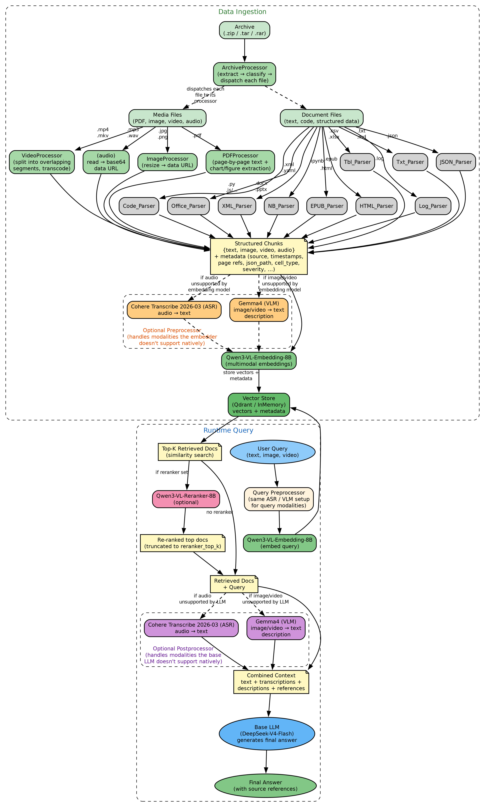

# Multimodal RAG

End-to-end multimodal retrieval-augmented generation: ingest documents
in 17+ formats (text, PDF, images, video, audio, code, tables, office
docs, and more), embed them into a joint multimodal vector space, and
retrieve at query time with optional cross-encoder reranking — all
exposed via a REST API, an HTML frontend, and an MCP server.

<div align="center"></div>

---

## Features

- **Joint multimodal embedding** (text, image, video) via Qwen3-VL-Embedding-8B — search with any combination of modalities
- **Audio support** via ASR transcription (Cohere Transcribe) — audio is converted to text before embedding
- **17+ file formats** with format-specific chunking: PDF (page-by-page + image extraction), images, video (overlapping segments), audio, text/markdown, JSON, XML, YAML, CSV/Excel, code (16 languages), HTML, Office docs, Jupyter notebooks, EPUB, log files, archives
- **Cross-encoder reranking** via Qwen3-VL-Reranker-8B for improved precision at the cost of latency
- **Modality conversion** — retrieved media the LLM doesn't support is auto-converted (images/video → VLM description, audio → ASR transcript)
- **Dataset management** — password-protected datasets, per-dataset Qdrant collections, dedup (cosine ≥ 0.995), S3/HTTP URL ingestion
- **MCP server** — 9 tools (search, list, recall, store memory, describe media, transcribe audio) over streamable-http / stdio / sse
- **Long-term memory** — per-user LLM-curated memory store for opencode and Open WebUI, with SSO-backed isolation
- **Open WebUI extension** — filter that routes unsupported modalities to the RAG MCP tool, plus inlet/outlet memory hooks
- **Helm chart** — 2-container pod (API + MCP sidecar), Qdrant StatefulSet, Istio/EZUA ingress with oauth2-proxy

---

## Architecture

```
┌─────────────────────────────────────────────────────┐
│  Pod                                                 │
│                                                      │
│  ┌──────────────────┐   ┌──────────────────┐        │
│  │  API Server       │   │  MCP Server       │       │
│  │  port 8000        │   │  port 9090        │       │
│  │  (REST + Web UI)  │   │  (MCP tools)      │       │
│  └──────┬───────────┘   └──────┬───────────┘        │
│         │                      │                     │
│         └──────────┬───────────┘                     │
│                    │                                 │
│             ┌──────┴──────┐                          │
│             │   PVC /data  │  ← datasets + files    │
│             └─────────────┘                          │
└──────────────────────┬──────────────────────────────┘
                       │
              ┌────────┴────────┐
              │  Qdrant          │  ← StatefulSet
              │  (port 6333)     │
              └──────────────────┘
```

Both the API server and MCP server connect to the same Qdrant instance
and share the same PVC, so datasets created through the web UI are
immediately searchable via MCP tools and vice versa.

---

## Documentation

| Document | What it covers |
|---|---|
| **[USAGE.md](USAGE.md)** | HTML frontend usage + programmatic Python API |
| **[documentation/DEPLOYMENT.md](documentation/DEPLOYMENT.md)** | Build the image, install the helm chart, verify, troubleshoot |
| **[documentation/MCP.md](documentation/MCP.md)** | All 9 MCP tools + connection configs for opencode, Claude Desktop, OWUI, stdio |
| **[documentation/MEMORY.md](documentation/MEMORY.md)** | Long-term memory setup per client (opencode + Open WebUI), multi-user isolation, operations |
| **[documentation/FEATURES.md](documentation/FEATURES.md)** | Deep technical reference: every format, chunking strategy, embedding, reranking, storage |
| **[documentation/AGENTS.md](documentation/AGENTS.md)** | opencode agent policy: when to recall / write memories |
| **[documentation/opencode.jsonc](documentation/opencode.jsonc)** | opencode MCP config template (two-connection memory pattern) |
| **[documentation/DEVELOPMENT_NOTES.md](documentation/DEVELOPMENT_NOTES.md)** | Embedding/reranker validation, pipeline benchmarks, model setup debugging |
| **[openwebui_extension/README.md](openwebui_extension/README.md)** | Open WebUI filter: media routing, memory valves, per-user HMAC isolation |

---

## Quick start

```bash
# Deploy to Kubernetes (see documentation/DEPLOYMENT.md for full guide)
export DOMAIN_NAME="your-domain.com"
envsubst < helm/values.yaml > values-resolved.yaml

helm install multimodal-rag ./helm \
  -f values-resolved.yaml \
  --set models.embedder.url="https://..." \
  --set models.reranker.url="https://..." \
  --set models.vlm.url="https://..." \
  --set models.asr.url="https://..." \
  --set modelSecrets.embedderApiKey="eyJ..."

# Verify
kubectl get pods -l app=rag-mcp-server
kubectl port-forward deployment/rag-mcp-server 8000:8000
# → http://localhost:8000
```

The image does not bundle any ML models — it connects to remote model
endpoints (embedder, reranker, VLM, ASR) configured at runtime via
environment variables. See `documentation/DEPLOYMENT.md` for details.

---

## Security hardening (opt-in)

The core server is **unauthenticated by default** and is designed to sit
behind an ingress auth proxy (Istio + oauth2-proxy). For additional,
opt-in protection (per-process env vars, or first-class [Helm
`security` values]), set any of the following:

| Env var | Purpose | Default |
|---|---|---|
| `RAG_API_KEY` | Require `Authorization: Bearer <key>` (or `X-RAG-Api-Key`) on all `/api/*` routes (health/probes, frontend pages, and media serving stay open; `/docs` is effectively disabled). | unset (no auth) |
| `MEDIA_TOKEN_SECRET` | Secret shared by API + MCP so returned media URLs carry short-lived HMAC `?token=` (expiry `MEDIA_TOKEN_TTL`) instead of the dataset `?password=` in the clear. | unset (legacy `?password=`) |
| `INGEST_ALLOW_HOSTS` | Comma-separated host allowlist for `/batch-urls` http(s) ingestion (`.example.com` matches subdomains). | unset (all hosts) |
| `INGEST_BLOCK_PRIVATE_HOSTS` | Reject http(s) URLs (ingest) that resolve to private/loopback/link-local ranges. | `false` |
| `MAX_REMOTE_DOWNLOAD_BYTES` | Cap per remote/S3 download (streamed, aborted past this). | 536870912 |
| `ARCHIVE_MAX_TOTAL_BYTES` / `ARCHIVE_MAX_MEMBER_BYTES` / `ARCHIVE_MAX_ENTRIES` | Zip/tar/rar unpacked-size caps (incl. nested archives). | 2 GiB / 1 GiB / 10000 |
| `MEDIA_ALLOW_PATH_PREFIXES` | Allowlist of `file://` prefixes the MCP `describe_media`/`transcribe_audio`/audio-query tools may read (`:`-separated). | unset (unrestricted) |
| `PW_MAX_FAILURES` / `PW_FAIL_WINDOW` | Password-failure throttle (returns 429 per identity). | 10 / 300 s |
| `QUERY_EMB_CACHE_MAX`, `FILE_HASH_CACHE_MAX`, `ASR_TRANSCRIPT_CACHE_MAX`, `UNLOCK_CACHE_MAX` | Bounded sizes for the in-process caches. | 4096 / 4096 / 512 / 4096 |

All defaults preserve the pre-1.9 behaviour. `helm/`, `helm-scale/` and
`helm-scale-g2/` ship a `security:` values block wired to these flags, e.g.:

```bash
helm upgrade multimodal-rag ./helm \
  --set security.mediaTokenSecret="$RANDOM" \
  --set security.apiKey="change-me" \
  --set security.blockPrivateHosts=true
```

> Keep deployment secret material (e.g. `helm/.values.yaml`, which contains
> Kubernetes service-account tokens) out of version control — it is not
> covered by `.gitignore`.
