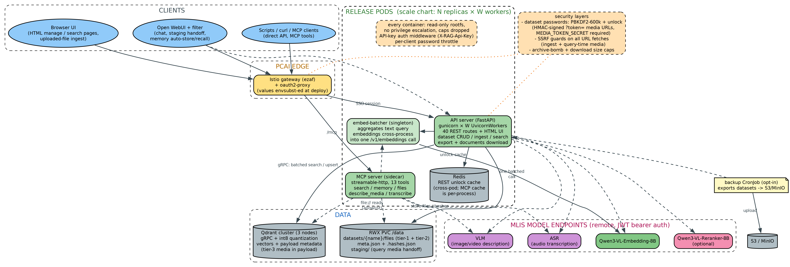

# Deployment Guide

> **PCAI is a Kubernetes wrapper — you never run `helm` or `kubectl`.** You import the packaged chart (`rag-mcp-server` `.tar.gz`) into PCAI once, then drive the deployment by setting the chart's
> **`values.yaml`** in the PCAI *Helm Values* editor (or via the PCAI API). Every `--set` in this guide maps 1:1 to a key in `values.yaml`. There is no `envsubst` step — set the actual domain value
> directly in `values.yaml`.


<div align="center"> Istio gateway/oauth2-proxy -> API server + MCP sidecar + embed-batcher + Redis -> Qdrant cluster + PVC -> MLIS model endpoints, with security layers annotated"></div>

---

> **⚠ Required config: `MEDIA_TOKEN_SECRET`**
>
> Since v1.9.5, both the API and MCP containers **refuse to start** without `MEDIA_TOKEN_SECRET` set. Media URLs are served via short-lived HMAC tokens (the legacy `?password=` URLs were removed), and
> this shared secret is what signs/verifies them. Deploying without it crashes both pods.
>
> It is still **settable in one of four ways** (the chart renders the Secret `<deployment.name>-model-keys`, see §3's Secrets-mechanism note and `helm/ROTATION.md`): inline `security.mediaTokenSecret`
> (back-compat), your own Secret via `security.existingSecret`, reuse of a previous install's release Secret, or **fresh auto-generation on first install** — the last is the default, so the common
> case needs no pre-deployed Secret at all. To pin it explicitly, generate one and set it in `values.yaml` before deploying:
>
> ```bash python -c "import secrets; print(secrets.token_hex(32))" # -> values.yaml:  security.mediaTokenSecret: "<output>" ```

---

## Prerequisites

- A PCAI environment where you can import the packaged chart and edit its values.
- The image is public in `ghcr.io/ai-solution-eng/...` — you only need registry push access if you build a custom image.
- Model endpoints (embedder, reranker, VLM, ASR) deployed through MLIS, with their API tokens.

---

## 1. Import the chart in PCAI and set the image

The packaged charts ship with the chart default `image.tag` as the default image — no image build is required (the current packaged default is `ghcr.io/ai-solution-eng/multimodal-rag-mcp:v4.4.1`, per `image.repository`/`image.tag` in each chart's `values.yaml`). If you need a custom build, the Dockerfile lives at `docker/Dockerfile` and expects the repo root as the build context; push the result to your registry and override the values:

```yaml
# values.yaml
image:
  repository: ghcr.io/ai-solution-eng/multimodal-rag-mcp
  tag: v4.4.1
```

> **Note on models**: The image does not bundle any ML models. It connects to remote model endpoints configured via values; the defaults point to models hosted on the PCAI internal cluster.

---

## 2. Configure deployment values

All configuration lives in the chart's `values.yaml`. Key settings you edit in the PCAI *Helm Values* editor:

```yaml
# PVC sizes — adjust for your dataset scale
persistence:
  data:
    size: 200Gi        # Uploaded files + dataset metadata
    storageClass: gl4f-filesystem   # must be RWX-capable for the shared /data mount
    accessMode: ReadWriteMany       # RWO breaks multi-pod/multi-container /data sharing
  qdrant:
    size: 150Gi        # Qdrant vectors + index
    storageClass: gl4f-filesystem
    accessMode: ReadWriteMany       # volumeClaimTemplate access mode (base chart: RWMany)
    mountReadOnly: true             # API/MCP pods mount the Qdrant PVC read-only
                                    # (/api/admin/health disk reporting) — leave true

# Model configuration — each model has name, url, className, and
# optional extra kwargs. Set url to "" to disable a component.
models:
  embedder:
    name: "Qwen/Qwen3-VL-Embedding-8B"
    url: "https://..."              # required
    className: "MultiModalEmbeddings"
  reranker:
    name: "Qwen/Qwen3-VL-Reranker-8B"
    url: "https://..."              # optional — empty string disables
    className: "MultiModalReranker"
  vlm:
    name: "Qwen/Qwen3.8-27B-FP8"    # any OpenAI-compatible VLM
    url: "https://..."              # optional — empty string disables
  asr:
    name: "CohereLabs/cohere-transcribe-03-2026"
    url: "https://..."              # optional — empty string disables
    # Each role has its own dotted key: models.embedder.url (required),
    # models.reranker.url / models.vlm.url / models.asr.url (optional).
    # An empty url disables that component at startup (a warning, not a crash).

Only the **embedder** is required: an unreachable embedder aborts startup.
Reranker/VLM/ASR are optional — if unreachable, startup logs a warning and
continues without them (reranking/captioning/transcription degrade).

# Model API keys (stored in a Kubernetes Secret, never in the image)
modelSecrets:
  embedderApiKey: "eyJ..."
  rerankerApiKey: "eyJ..."
  vlmApiKey: "eyJ..."
  asrApiKey: "eyJ..."

# S3 / MinIO — used by batch-URL ingest, watched-sources sync and backups.
# The endpoint is non-sensitive (ConfigMap); keys go into the model-keys Secret.
# Leave both keys "" to use the default boto3 credential chain instead.
s3:
  endpointUrl: http://minio.minio.svc.cluster.local:9000
  accessKeyId: ""
  secretAccessKey: ""

# RAG pipeline defaults
rag:
  captionWithAsr: true    # Transcribe video audio tracks via ASR during ingestion (auto-disables if no ASR model)
  captionWithVlm: true    # VLM-describe images/videos at ingest (auto-disables if no VLM; enables VLM-skip at retrieval)
  remote: false           # Use remote model URLs vs in-cluster .svc.cluster.local
  dedupThreshold: 0.995   # Cosine similarity above which an ingest candidate is
                          # dropped as a near-duplicate (0.0–1.0)

# MCP server (sidecar)
mcp:
  enabled: true
  port: 9090
  # OPTIONAL MCP API-key auth (fleet decision 2026-09): point at a Secret whose
  # key holds the comma-separated key list; every /mcp request then needs a
  # valid key (X-API-Key or Bearer). Leave empty for gateway-fronted
  # deployments — the server runs open with a loud startup warning. To switch
  # the gate on, pre-deploy the Secret first (the chart never creates or
  # inlines this key):
  #   kubectl -n <ns> create secret generic mcp-fleet-apikeys \
  #     --from-literal='api-keys=<key1>,<key2>'
  apiKey:
    existingSecret: ""      # e.g. "mcp-fleet-apikeys"
    existingSecretKey: api-keys

# Security — REQUIRED: a shared secret for short-lived media HMAC tokens.
# Both the API and MCP servers refuse to start without it (the legacy
# ?password= media URLs were removed). Also raises the SSRF guard defaults.
security:
  mediaTokenSecret: "<random-string-shared-by-both-containers>"
  mediaTokenTtl: 3600
  ingestAllowHosts: ""        # e.g. ".minio.svc.cluster.local" (bypasses private-block)
  blockPrivateHosts: true     # default on — blocks SSRF targets

# Metrics (optional): render a prometheus-operator ServiceMonitor for /metrics.
metrics:
  serviceMonitor: false
  interval: 30s
  # When security.metricsAuth is on, name a Secret whose <key> holds a valid
  # API key; the ServiceMonitor presents it as the scrape bearer token.
  serviceMonitorBearerSecret: ""
  serviceMonitorBearerSecretKey: RAG_API_KEY

# PCAI / EZUA (Istio-based ingress)
ezua:
  enabled: true
  virtualService:
    endpoint: "rag-mcp-server.<your-domain>"   # REQUIRED when ezua.enabled — the render fails without it
    istioGateway: "istio-system/ezaf-gateway"
    timeout: 300s          # default tier; longTimeout: 3600s covers batch uploads / SSE / MCP
  authorizationPolicy:
    namespace: "istio-system"
    providerName: "oauth2-proxy"
```

### Security knobs (`security.*`)

All of these flow into the ConfigMap as hardening env vars; defaults are shown
in `values.yaml` (both examples in `helm/values-examples/` set them too):

| Key | Default | Effect |
|---|---|---|
| `security.maxDownloadBytes` | `536870912` (512 MiB) | Per remote/S3 download cap — streams are aborted past this (SSRF blast-radius guard) |
| `security.archiveMaxTotalBytes` | `2147483648` (2 GiB) | Zip/tar/rar unpacked-size cap, nested archives included |
| `security.archiveMaxMemberBytes` | `1073741824` (1 GiB) | Per-member unpacked-size cap |
| `security.archiveMaxEntries` | `10000` | Per-archive entry count cap (zip-bomb guard) |
| `security.mediaAllowPathPrefixes` | `/data/datasets:/data/staging` | `file://` prefixes the MCP `describe_media`/`transcribe_audio`/audio-query tools may read (`:`-separated, fail-closed) |
| `security.pwMaxFailures` | `10` | Password-failure throttle: failures per identity before 429s (REST + MCP unlock) |
| `security.pwFailWindow` | `300` | Window (seconds) those failures are counted over |
| `security.metricsAuth` | `false` | Require an API key on `/metrics` (`X-RAG-Api-Key`/`X-API-Key`/Bearer); pair with `metrics.serviceMonitorBearerSecret` |

### Multi-user access knobs (D15/D16/D17 — opt-in)

| Key | Default | Effect |
|---|---|---|
| `mcp.apiKeyClients` / `mcp.datasetAcls` | `""` / `""` | **D15** — per-user registry keys + dataset ACLs (`name:key;name:key` / `name:ds1,ds2;name2:*`). KEY MATERIAL — render only when set; provide from a Secret pipeline, never commit. See the `RAG_API_KEY_CLIENTS` row in the base README. |
| `security.accessStore` | `true` | **D16** — the `/access` checkbox model: registry keys select their own datasets (protected ones with the password, saved per identity under `/data/access`) and bind their ★ memory dataset. Effective access = operator ACL ∪ selections. |
| `security.accessDenySelect` / `security.memoryDefault` | `""` / `""` | **D16** ceiling/fallback: datasets that can never be self-selected; the deployment-wide fallback memory dataset. Render only when non-empty. |
| `rag.unlockMaxTtl` | `86400` | Bound for explicit unlock TTLs on both surfaces; `0` opts into no-expiry unlocks (the `/access` page's "No expiry (0)" option). |

With the access store on, an ADMIN key additionally gets the **User keys** panel on
`/access` (**D17**): mint per-user keys, set dataset grants, rotate, revoke — against a
file-backed overlay at `{DATA_PATH}/access/clients.json` (merged with the
`mcp.apiKeyClients` env; env authoritative on key conflicts). No restart needed.

### Standard Kubernetes knobs

These are plain Kubernetes fields surfaced for completeness — the chart
defaults are sensible and PCAI operators rarely touch them:

| Key | Default | Effect |
|---|---|---|
| `deployment.appName` | `rag-mcp-server` | `app` label on every rendered resource (selective delete/monitor target) |
| `image.pullPolicy` | `IfNotPresent` | Pull policy for the app image (both containers + CronJobs) |
| `persistence.data.accessMode` | `ReadWriteMany` | PVC access mode for the shared `/data` claim |
| `persistence.data.storageClass` | `gl4f-filesystem` | StorageClass for the data PVC (must be RWX-capable) |
| `persistence.qdrant.accessMode` | `ReadWriteMany` | Qdrant PVC access mode (from its StatefulSet `volumeClaimTemplates`) |
| `persistence.qdrant.storageClass` | `gl4f-filesystem` | StorageClass for the Qdrant PVC |
| `persistence.qdrant.mountReadOnly` | `true` | Mount the Qdrant PVC read-only on the API/MCP pods for disk-usage reporting (disable if the claim is not shared) |
| `resources.app.requests/limits.memory·cpu` | 2Gi/8Gi mem, 2/4 cpu | Per-container resources for `rag-api-server` and `rag-mcp-server` — the dotted paths are `resources.app.requests.memory` / `resources.app.requests.cpu` / `resources.app.limits.memory` / `resources.app.limits.cpu` |
| `resources.qdrant.requests/limits.memory·cpu` | 16Gi/32Gi mem, 4/8 cpu | Per-pod resources for the Qdrant StatefulSet — `resources.qdrant.requests.memory` / `resources.qdrant.requests.cpu` / `resources.qdrant.limits.memory` / `resources.qdrant.limits.cpu` |
| `qdrant.image.pullPolicy` | `IfNotPresent` | Pull policy for the Qdrant image |

### Qdrant runtime values

| Key | Default | Effect |
|---|---|---|
| `qdrant.image.tag` | `v1.19.0` | Qdrant server image tag (pinned; upgrade deliberately, collections must stay compatible) |
| `qdrant.httpPort` | `6333` | HTTP port the app talks to (`--qdrant-port` / `QDRANT_PORT`); also the healthz probe port |
| `qdrant.grpcPort` | `6334` | gRPC port exposed on the headless Qdrant service (used by gRPC-preferring clients on the scale charts) |
| `qdrant.telemetryDisabled` | `true` | Sets `QDRANT__TELEMETRY_DISABLED=true` — stops hourly failed phone-homes to `telemetry.qdrant.io` on egress-restricted clusters |

```yaml
# Resources — scale based on expected Qdrant load (per-container; the pod
# runs an API + MCP container, so app resources apply 2x per pod)
resources:
  app:
    requests:
      memory: 2Gi
      cpu: 2
    limits:
      memory: 4Gi
      cpu: 4
  qdrant:
    requests:
      memory: 16Gi
      cpu: '4'
    limits:
      memory: 48Gi   # ~40 GiB needed for 1M × 4096-dim vectors
      cpu: '8'
```

Two RAG keys are deliberately gated and render nothing while disabled — enable
them only with intent:

- `rag.rrfDefault` (`enabled`, `dense`, `sparse`, `k`) — stamps a per-dataset
  weighted-RRF default (`RAG_RRF_DEFAULT`, format `dense,sparse[,k]`) into every
  NEW dataset at create time. `enabled: false` (default) stamps nothing and new
  datasets inherit the global 1.0/1.0 rank order. When enabled, a `dense`/`sparse`
  weight above 1.0 makes that retrieval lane's rank positions count more in the
  fused ordering (rank-space tilt — trust the order, not the magnitude) and
  `rag.rrfDefault.k` is the RRF ranking constant (default 2). An explicit `rrf`
  object on `POST /api/datasets` always wins; existing datasets are untouched
  (PATCH them).
- `rag.contextual` — stamps `contextual: true` into NEW datasets (ingest-time
  contextual retrieval; one small LLM call per real-text chunk). Off by default;
  existing datasets are untouched.

The optional backup CronJob (`backups.enabled`) exports every
non-password-protected dataset on a schedule (`backups.schedule`), uploads the
`.tar.gz` archives to `backups.bucket` (reusing the `s3.*` credentials), and —
when `backups.retentionDays` > 0 — prunes backup objects older than that.

> The `${DOMAIN_NAME}` placeholder is resolved by PCAI's deployment pipeline before helm runs — submitted values are envsubst-ed (verified: the deployed release stores the fully-resolved endpoint). Keep
> the placeholder in `ezua.virtualService.endpoint` as-is. Note that `ezua.domainName` itself is a platform-convention key no chart template reads; the VirtualService is built from
> `ezua.virtualService.endpoint`.

---

## 3. Install / update in PCAI

Import the packaged `rag-mcp-server` chart into PCAI, then set the values above (image, models + `modelSecrets`, `security.mediaTokenSecret`, persistence sizes, `ezua.*`) in the *Helm Values* editor and apply. Model URLs and API keys are required.

To change a setting later, edit the values in PCAI and apply again — that is the only "upgrade" path you need.

```yaml
# values.yaml — the keys PCAI renders from (also shown above)
image:
  repository: ghcr.io/ai-solution-eng/multimodal-rag-mcp
  tag: v4.4.1
models:
  embedder:
    name: "Qwen/Qwen3-VL-Embedding-8B"
    url: "https://..."
    className: "MultiModalEmbeddings"
  reranker:
    name: "Qwen/Qwen3-VL-Reranker-8B"
    url: "https://..."
    className: "MultiModalReranker"
  vlm:
    name: "Qwen/Qwen3.8-27B-FP8"
    url: "https://..."
  asr:
    name: "CohereLabs/cohere-transcribe-03-2026"
    url: "https://..."
modelSecrets:
  embedderApiKey: "eyJ..."
  rerankerApiKey: "eyJ..."
  vlmApiKey: "eyJ..."
  asrApiKey: "eyJ..."
persistence:
  data:
    size: 500Gi
  qdrant:
    size: 200Gi
security:
  mediaTokenSecret: "<generated>"
ezua:
  virtualService:
    endpoint: "rag-mcp-server.<your-domain>"
```

> **Tip**: keep the model URLs and API keys in a private values fragment (or the PCAI Secret) so they stay out of commit history; the chart reads them from values at apply time.
>
> The chart itself ships **no key material** (`security.apiKey` / `security.mediaTokenSecret` are empty by default — P0-7, 2026-09): keys are sourced from `security.existingSecret` (a Secret you own; key names `security.existingSecretApiKey` / `security.existingSecretMediaTokenKey`), inline values (back-compat), the release Secret from a previous install (reused on upgrade), or fresh auto-generation on first install — in that precedence order. See `helm/ROTATION.md` for the full runbook.

---

## 4. Verify the deployment

In the PCAI UI the deployment should reach **Ready**. To check locally (optional, developer convenience):

```bash
# Port-forward to test locally
kubectl port-forward deployment/rag-mcp-server 8000:8000

# Health check
curl http://localhost:8000/healthz
# → {"status": "ok"}

# List datasets (empty initially)
curl http://localhost:8000/api/datasets
# → {"datasets": []}
```

Pods and logs are visible from the PCAI workload view (\cmd{kubectl get pods -l app=rag-mcp-server} and \cmd{kubectl logs -l app=rag-mcp-server -c rag-api-server} work the same as ever for operators who have cluster access).

---

## 5. Access the web UI

If EZUA (Istio) is enabled, the service is available at the VirtualService endpoint (e.g. `https://rag-mcp-server.<your-domain>`). Authentication is handled by the `oauth2-proxy` AuthorizationPolicy.

For a local developer preview only, port-forward:

```bash
kubectl port-forward deployment/rag-mcp-server 8000:8000
# → http://localhost:8000
```

The UI lets you:
- **Create datasets** with optional video captioning toggle
- **Upload files** (PDF, images, videos, audio, text) via drag-and-drop
- **Add text** in the standardized multimodal format
- **Search** with configurable `top_k` and reranker toggle
- **Browse stored documents** in each dataset

---

## 5b. Deployment profiles: Internal G2 vs Hosted trial

Everything above is identical for both site classes — the profile only changes
five values (and one pre-created Secret). `helm/values-examples/` ships a
sanitized paste-ready values document for each profile:

| | **Internal G2** (`values-examples/values.g2.yaml`) | **Hosted trial** (`values-examples/values.hosted-trial.yaml`) |
|---|---|---|
| `ezua.virtualService.endpoint` | Literal site domain (e.g. `rag-mcp-server.pcai-se-ai-application.hst.rdlabs.hpecorp.net`) — or `rag-mcp-server.${DOMAIN_NAME}` | `rag-mcp-server.${DOMAIN_NAME}` — PCAI substitutes the placeholder before rendering; keep it as-is |
| `ezua.authorizationPolicy.enabled` | `false` — the ezaf-gateway applies HPE SSO centrally; the chart creates no AuthorizationPolicy | `true` (default) — customer SSO via oauth2-proxy at the gateway |
| Model endpoints | Real shared serving URLs (`.serving.` → kept, with `rag.remote: false` rewriting them to in-cluster `.svc.cluster.local`) | Customer MLIS endpoints; `rag.remote: true` only for endpoints outside the cluster |
| Egress | In-cluster only — model URLs resolve as `.svc.cluster.local`; no outbound proxy involved | If the customer cluster routes model traffic through the HPE/corporate proxy, set the proxy envs via `extraEnv` (e.g. `HTTPS_PROXY`); the SSRF DNS-rebinding pin is skipped when a proxy performs egress DNS |
| Kyverno ClusterPolicy | The G2 cluster runs Kyverno (EzAF) — the pre-install hook creates the vendor-label policy (Deployment/Service only) | Customer admin may need to permit ClusterPolicy creation on locked-down clusters; the `values.hosted-trial.yaml` header flags this |
| `mcp.apiKey.existingSecret` | `mcp-fleet-apikeys` (pre-created in the namespace) | `mcp-fleet-apikeys` or empty — see the Secret strategy in §3 |

Pick the matching example file, paste it into the *Helm Values* editor, adjust
the `# SITE:` lines, apply. The same two postures exist for the
`helm-scale-medium/` and `helm-scale-large/` variants (each chart's
`values-examples/` carries both files). The scale charts expose the same
`metrics.serviceMonitorBearerSecret` / `…BearerSecretKey` keys as the base
chart, so a `security.metricsAuth`-on deployment keeps Prometheus scraping
working at every chart size.

### Secret requirements — front and center

The chart itself ships **no key material**. Before (or at) first apply, these
Secrets/values must exist — everything else is optional tuning:

1. **Platform keys — required.** `security.existingSecret` (recommended) names a
   Secret **you own** carrying BOTH keys; without them the containers refuse to
   start:
   ```bash
   kubectl -n <ns> create secret generic rag-platform-keys \
     --from-literal=RAG_API_KEY="$(openssl rand -hex 16)" \
     --from-literal=MEDIA_TOKEN_SECRET="$(openssl rand -hex 32)"
   ```
   (Alternative: leave everything empty and let the chart auto-generate both on
   first install into `<deployment.name>-model-keys`; or set
   `security.apiKey` / `security.mediaTokenSecret` inline — back-compat.
   Precedence and the optional rotation runbook: `helm/ROTATION.md`.)
2. **Model API keys** — `modelSecrets.*ApiKey` in values (rendered into the
   `<name>-model-keys` Secret); paste the platform JWT per MLIS endpoint.
3. **MCP keys (optional)** — `mcp.apiKey.existingSecret: mcp-fleet-apikeys` +
   `kubectl -n <ns> create secret generic mcp-fleet-apikeys
   --from-literal='api-keys=<key1>,<key2>'`. The chart never creates or inlines
   this key.

### Fail-closed default (D20, 2026-09-24)

A deployment with **no** `RAG_API_KEY` and no key registry no longer runs open:
unauthenticated callers bind an **anonymous identity** whose only grant is the
deployment's memory dataset (`MEMORY_DATASET` env, when set — dataset paths and
`/api/admin/*` answer 403, dataset creation 403). Configure any key
(`security.apiKey` / `existingSecret` / the MCP keyset / registry) to get the
normal full-access behaviour — every chart-managed deployment already does.
`MEMORY_DATASET` (and `RAG_MEMORY_PASSWORD`) are settable via `extraEnv` in
values — e.g. `extraEnv: {MEMORY_DATASET: "team-memory"}`.

---

## 6. Connect an MCP client

When `mcp.enabled=true` (default), the MCP server runs as a sidecar container exposing `streamable-http` transport on port 9090 at `/mcp`.

For the full tool list, connection configs (opencode, Claude Desktop, Open WebUI, stdio), and the long-term memory setup, see:

- **[MCP.md](MCP.md)** — all 19 MCP tools + connection configs for any client
- **[MEMORY.md](MEMORY.md)** — per-user long-term memory setup (opencode + Open WebUI)

### Quick reference

```json
{
  "mcpServers": {
    "multimodal-rag": {
      "url": "https://rag-mcp-server.your-domain.com/mcp",
      "headers": { "Authorization": "Bearer <token>" }
    }
  }
}
```

---

## 7. Architecture overview

```
┌─────────────────────────────────────────────────────┐
│  Pod                                                 │
│                                                      │
│  ┌──────────────────┐   ┌──────────────────┐        │
│  │  API Server       │   │  MCP Server       │       │
│  │  port 8000        │   │  port 9090        │       │
│  │  (REST + Web UI)  │   │  (MCP tools)      │       │
│  └──────┬───────────┘   └──────┬───────────┘        │
│         │                      │                     │
│         └──────────┬───────────┘                     │
│                    │                                 │
│             ┌──────┴──────┐                          │
│             │   PVC /data  │  ← datasets + files    │
│             └─────────────┘                          │
└──────────────────────┬──────────────────────────────┘
                       │
              ┌────────┴────────┐
              │  Qdrant (port 6333) │  ← StatefulSet
              │  ┌──────────────┐  │
              │  │ PVC /qdrant  │  │  ← vectors + index
              │  │   storage    │  │
              │  └──────────────┘  │
              └───────────────────┘
```

Both the API server and MCP server connect to the same Qdrant instance and share the same PVC, so datasets created through the web UI are immediately searchable via MCP tools and vice versa.

### EZUA / Istio integration

When `ezua.enabled=true` (default), the chart also creates:

- **VirtualService** — routes `ezua.virtualService.endpoint` through `ezua.virtualService.istioGateway` (default `istio-system/ezaf-gateway`), with three timeout tiers: batch uploads/SSE and `/mcp` get `ezua.virtualService.longTimeout` (3600s), everything else `ezua.virtualService.timeout` (300s). The endpoint is **required** — with it unset the chart render fails with `Valid .Values.ezua.virtualService.endpoint is required !`, and the endpoint value is also what builds `MEDIA_BASE_URL` (PVC-path → HTTPS media URLs in MCP search results)
- **AuthorizationPolicy** (`ezua.authorizationPolicy.enabled`, default `true`) — enforces OAuth2 authentication at the Istio ingress gateway, via provider `ezua.authorizationPolicy.providerName` (`oauth2-proxy`) in `ezua.authorizationPolicy.namespace` (`istio-system`). Set `enabled: false` where the gateway already applies SSO centrally (SE G2)
- **Kyverno ClusterPolicy** — auto-labels **Deployments and Services** in the release namespace with `hpe-ezua/type: vendor-service` and `hpe-ezua/app: rag-mcp-server` (required for the EZUA ingress to discover the service). **Pods are deliberately NOT matched** (fixed 2026-09-24): the EzAF platform ships its own admission policy that rewrites the scheduler on every pod carrying that `hpe-ezua/type` label, which made cron pods with orphaned finalizers undeletable — this chart version permanently immunizes the release against that interaction.

---

## 7b. Watched S3 sources (opt-in continuous sync)

For deployments with an S3/MinIO drop zone, the chart can run a reconciler CronJob that keeps
datasets continuously in sync with one or more bucket prefixes — no manual batch-URL uploads:

```yaml
# values.yaml (all three charts).  Default `enabled: false` renders NOTHING —
# deployments without S3 are byte-identical to before.
watchedSources:
  enabled: true
  schedule: "*/30 * * * *"          # cron schedule (default every 30 minutes)
  sources:
    - dataset: reports              # the dataset each prefix syncs INTO (must exist)
      prefixes:
        - s3://mm-rag-drop/reports/
    - dataset: logs
      prefixes:
        - s3://mm-rag-drop/logs/
        - s3://mm-rag-drop/trace-exports/
```

Behaviour per tick (serial per source, `concurrencyPolicy: Forbid`, fail-soft):

- POSTs the prefixes to `POST /api/datasets/{dataset}/batch-urls` with `sync: true` and the
  deployment key as `X-RAG-Api-Key` (from the model-keys Secret), then polls the ingest job to
  completion, so a slow embed batch cannot overlap the next tick.
- New and content-changed objects ingest; objects deleted upstream are pruned from the dataset.
- **Unchanged objects are skipped before any download** — a per-dataset sidecar
  (`files/.watched_state.json`) remembers the ETag+Size of the last successfully ingested
  version of each object; an object still matching it costs zero S3 I/O. Content changed under
  the same key flips the ETag and re-ingests. Delete or Recreate a dataset and the state resets.
- Config is validated at values-parse time (`helm template`): every prefix must be an `s3://`
  directory URL — single-object `s3://bucket/file.ext` URLs, wildcards, query strings and
  http(s) URLs fail the render, not the cron log. A `type:` field is reserved for future
  source kinds.
- The server-side bucket allowlist `INGEST_ALLOW_S3_BUCKETS` still applies — keep it set as the
  multi-tenant guard. The S3 credentials come from the existing `s3.*` values (the same
  `S3_ENDPOINT_URL` / `S3_ACCESS_KEY_ID` / `S3_SECRET_ACCESS_KEY` wiring batch-URL ingest uses).

> The backup CronJob (`backups.*`) presents the same API key since this release — it
> previously sent none and would 401 on every call under `security.apiKey`.

---

## 8. Upgrading

In PCAI, upgrading is just editing the values and applying again. To bump the image, change `image.tag` in the *Helm Values* editor (or a model-endpoint URL, a PVC size, etc.):

To change specific settings (e.g. storage or model endpoints), edit the corresponding keys in `values.yaml` and re-apply; the rest of the values are kept. API keys sourced from the release Secret are reused across upgrades (never rotated underneath a running deployment); the optional, operator-initiated rotation procedure — and the warning that rotated keys invalidate every issued media token — is `helm/ROTATION.md`.

---

## 9. Troubleshooting

| Symptom | Likely cause | Check |
|---------|-------------|-------|
| Pods stuck in `Pending` | PVC not binding | Check the PVC status in PCAI |
| API server crash-looping | Model connection failure | Read the API pod logs in PCAI |
| MCP tools return "dataset not found" | Dataset created on different Qdrant | Verify `QDRANT_HOST` matches |
| Search returns 0 results | Empty dataset or wrong collection | Check via web UI document list |
| Qdrant OOMKilled | Vector count exceeds memory | Increase `resources.qdrant.limits.memory` |
| Watched-sources cron pod stuck with an orphaned finalizer (old chart) | The pre-fix vendor-label policy matched Pod kind and the platform scheduler-mutation policy rejected every pod update | Deploy this chart version (policy matches Deployment/Service only); one-time cleanup for already-stuck pods: strip the finalizer AND the `hpe-ezua/type` label in one patch (see the CHANGELOG 2026-09-24 entry) |
| 404 at VirtualService endpoint | Kyverno labels not applied | Confirm the Deployment/Service carry the `hpe-ezua` labels (PCAI discovery reads Deployments/Services, not Pods) |
| 401 at VirtualService endpoint | OAuth2 token missing/expired | Check `oauth2-proxy` logs in `istio-system` |
| Endpoint shows `rag-mcp-server.<domain>` unresolved | Domain value not set | Set `ezua.virtualService.endpoint` in values.yaml |
